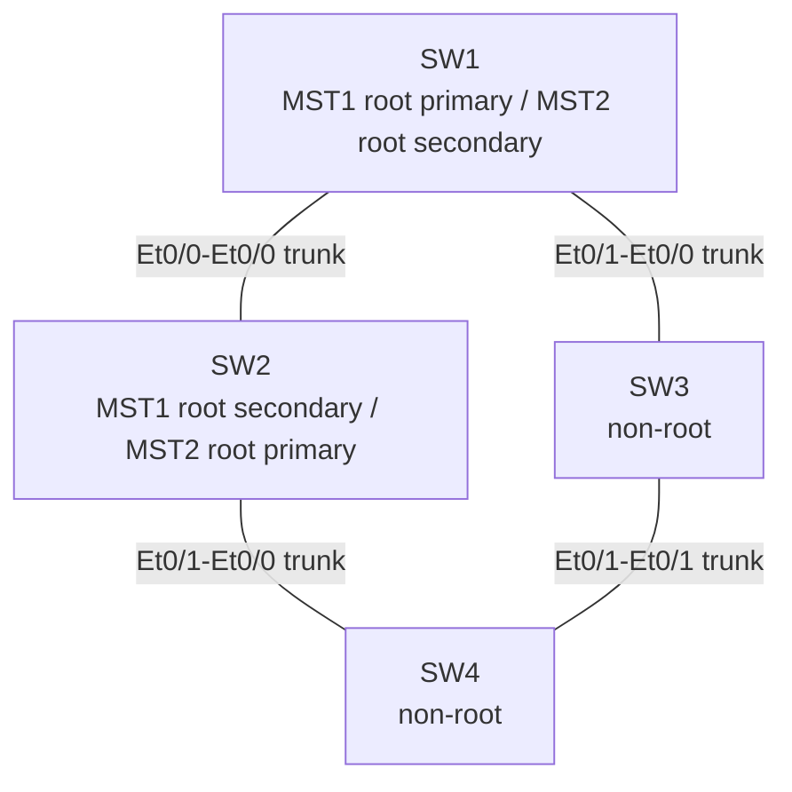

# mst-verification-lab

CML2 (Cisco Modeling Labs, v2.10.0+build.13) 上にIOL-L2×4台で構築したMultiple Spanning Tree (MST) 検証ラボ。リージョン境界の成立条件、インスタンスごとのルートブリッジ選定と負荷分散、リンク障害時の収束、Rapid PVST+との構造的な違いを、実機(IOL-L2)への実CLI投入と実show出力の採取によって検証した。

> 📋 **[スイッチパラメータシート(SW1〜SW4)を見る](https://claude.ai/artifact/XgUgNgy4Hf2yaruD1V1Vhc)** — 各スイッチのMST優先度・VLAN・インターフェース設定を1ページにまとめたHTML。ソースは [`docs/switch-parameter-sheet.html`](docs/switch-parameter-sheet.html)。

## 検証目的

- MSTでVLANをインスタンスに正しくマッピングし、インスタンスごとに異なるルートブリッジ/転送パスを構成できることを確認する。
- MSTリージョンの一致条件(リージョン名・リビジョン番号・VLANマッピングの完全一致)が崩れた場合に、実際にリージョン境界として扱われることを確認する。
- リンク障害時のSTP収束(Alternate→Root/Designatedへの遷移)を実測する。
- MSTとRapid PVST+の構造的な違い(STPインスタンス数、BPDU構造)を実測データで比較する。

## トポロジ図



インターフェース番号は全てCML APIで実際に払い出された値(推測ではない)。詳細は`topology.yaml`, `docs/topology.md`を参照。

## VLANとMSTインスタンスの対応

| VLAN | 名前 | MSTインスタンス |
|---|---|---|
| 10 | USERS-A | MST1 |
| 20 | USERS-B | MST1 |
| 30 | SERVERS-A | MST2 |
| 40 | SERVERS-B | MST2 |

MSTリージョン名: `CML-MST` / リビジョン: `1`

## 各スイッチの役割

| スイッチ | MST1 (VLAN10,20) | MST2 (VLAN30,40) | 備考 |
|---|---|---|---|
| SW1 | Root Primary | Root Secondary | |
| SW2 | Root Secondary | Root Primary | |
| SW3 | non-root | non-root | |
| SW4 | non-root | non-root | 試験4〜6でリージョン不一致の対象 |

## CMLへの接続方法

CML接続情報(URL・ユーザー名・パスワード)はWindows環境変数 `CML_URL` / `CML_USERNAME` / `CML_PASSWORD` に設定されている前提。値は本リポジトリを含むいかなるファイルにも保存していない。

REST API例(PowerShell 7+, 自己署名証明書のため`-SkipCertificateCheck`を使用):

```powershell
$body = @{ username = $env:CML_USERNAME; password = $env:CML_PASSWORD } | ConvertTo-Json
$token = (Invoke-WebRequest -Uri "$($env:CML_URL)/api/v0/authenticate" -Method Post -Body $body -ContentType 'application/json' -SkipCertificateCheck).Content | ConvertFrom-Json
$headers = @{ Authorization = "Bearer $token" }
Invoke-RestMethod -Uri "$($env:CML_URL)/api/v0/labs" -Headers $headers -SkipCertificateCheck
```

コンソール(CLI)操作は、CMLのWeb UIが内部で使用しているのと同じWebSocketエンドポイント(`wss://<host>/ws/dispatch/frontend/console`)をAPIのみで自動化した。具体的な手順:

1. `GET /api/v0/labs/{lab_id}/nodes/{node_id}/keys/console?line=0` で一時的なコンソールセッションUUIDを取得。
2. `wss://<host>/ws/dispatch/frontend/console?cml_client=WebUI&action=lab_exec&uuid=<uuid>` に接続。
3. 接続直後、最初のフレームとして`{"token": "<JWT>"}`を送信(認証)。
4. 以後は生のPTYパススルー(キー入力送信・端末出力受信)。

このプロトコルはCMLの配布JSバンドル(`/assets/*.js`)を読み取り専用で解析して特定した。手動でのWeb UI操作は一切使用していない。

## ラボの起動・停止方法

ラボID: `8cd6a53c-6870-4891-b51c-7ebe586f8360`(タイトル: `mst-verification-lab`)

```powershell
# 起動
Invoke-RestMethod -Uri "$($env:CML_URL)/api/v0/labs/8cd6a53c-6870-4891-b51c-7ebe586f8360/start" -Method Put -Headers $headers -SkipCertificateCheck

# 状態確認
Invoke-RestMethod -Uri "$($env:CML_URL)/api/v0/labs/8cd6a53c-6870-4891-b51c-7ebe586f8360" -Headers $headers -SkipCertificateCheck

# 停止
Invoke-RestMethod -Uri "$($env:CML_URL)/api/v0/labs/8cd6a53c-6870-4891-b51c-7ebe586f8360/stop" -Method Put -Headers $headers -SkipCertificateCheck
```

**現在の状態**: 本検証完了時点でラボは`STARTED`(稼働中)のまま残してある。停止・削除はユーザー側で判断のうえ実施すること(本作業では明示的な指示がない限り停止しない方針とした)。

## 試験手順・実測結果

詳細な手順は `docs/test-plan.md`、実測結果(実際のshow出力に基づく)は `docs/test-results.md` を参照。要約:

| 試験 | 内容 | 結果 |
|---|---|---|
| 1 | VLANマッピング確認 | VLAN10,20→MST1、VLAN30,40→MST2を実測確認 |
| 2 | ルートブリッジ・負荷分散 | MST1ルート=SW1、MST2ルート=SW2。SW3–SW4リンクのブロック位置がMST1/MST2で異なることを確認 |
| 3 | 高速収束 | SW2–SW4リンク障害から約3.5〜6.2秒でSTP再収束(実測、精度注記あり)。ping欠損4パケット |
| 4 | リージョン名不一致 | SW4が単独リージョン化することを確認。復旧済み |
| 5 | リビジョン番号不一致 | 同上。大小比較ロジックが存在しないことも確認。復旧済み |
| 6 | VLANマッピング不一致 | 同上。復旧済み |
| 7 | Rapid PVST+比較 | STPインスタンス数(MST:3 / PVST+:4)とBPDU構造の違いを確認。性能優劣は断定せず。復旧済み |

## 期待結果との差異

- `switchport trunk encapsulation dot1q` は仕様上「非対応なら省略」だったが、本イメージ(`ioll2-xe`, IOS-XE 17.18)では実際に対応していたため、投入・保持した(証跡: `docs/test-results.md`)。
- 試験3のping試験は、元仕様に端末/IPアドレッシングが含まれていなかったため、VLAN10のSVI(`192.168.10.1-4/24`)を試験専用に一時追加して代用した(ユーザー確認済み、仕様外の追加)。
- 収束時間の実測値はポーリング間隔(約0.3〜2.4秒)に起因する精度の限界があり、厳密なハードウェアキャプチャによる値ではない。

詳細差異は `docs/test-results.md` の「期待結果との差異」表を参照。

## 制約事項

- コンソール自動化は、CMLの配布JSバンドルを読み取り専用で解析して得たプロトコル(非公開・非公式)に依存している。CMLのバージョンアップでこのWebSocketプロトコルが変更されると動作しなくなる可能性がある。
- 収束時間の測定はCLIポーリングベースであり、サブ秒単位の精度は保証しない。
- 試験3のping評価はスイッチ自身のSVIを使った代用であり、本来の「端末」を用いた検証ではない。
- Rapid PVST+比較でのCPU使用率など性能面の定量評価は実施していない(VLAN数が少なく有意差が出ないと判断したため)。

## 復旧手順

各障害試験は実施直後に必ず元の共通設定へ戻し、復旧後の実出力を採取済み(`outputs/*/reverted-*.txt`, `outputs/failover/`の末尾、`outputs/rapid-pvst-comparison/*-post-revert-*.txt`)。手動で復旧が必要になった場合の手順:

1. 全スイッチで `show spanning-tree mst configuration` を確認し、`Name [CML-MST]` / `Revision 1` / `instance 1 vlan 10,20` / `instance 2 vlan 30,40` になっていることを確認する。異なる場合は `configs/SW{1-4}.cfg` の該当ブロックを再投入する。
2. 全スイッチで `show spanning-tree mode` (または `show spanning-tree summary` の1行目)を確認し、`mst`モードになっていることを確認する。`rapid-pvst`のままであれば `spanning-tree mode mst` を投入する。
3. 全スイッチで `show interfaces status` を確認し、Et0/0・Et0/1が`connected/trunk`、Et0/2・Et0/3が`disabled`であることを確認する。
4. `show spanning-tree mst 1` / `mst 2` で、SW1がMST1ルート、SW2がMST2ルートであることを確認する。

## MSTリージョン一致条件

2台のMSTスイッチが同一リージョンに属するためには、以下の3要素が**完全に一致**している必要がある。

1. リージョン名(`spanning-tree mst configuration` の `name`)
2. リビジョン番号(`revision`)
3. VLAN→インスタンスのマッピング(`instance <n> vlan <list>`、MD5ダイジェストとして比較される)

**重要な注意点**: リビジョン番号は単なる識別子であり、**数値の大小によって「どちらが優先されるか」が決まるものではない**。試験5で実測した通り、revisionが2のスイッチが他のスイッチを「上書き」したり優先されたりすることはなく、単純に別リージョンとして扱われるだけであった。3要素のいずれか1つでも異なれば、その時点で別リージョン(=CISTのみでBPDUを交換する境界)として扱われる。

## Rapid PVST+との比較

試験7の実測結果(詳細は`docs/test-results.md`)より:

- MSTは1つのMSTP BPDU(CIST BPDU)にMレコードとして複数インスタンスの情報を多重化して送信するのに対し、Rapid PVST+はVLANごとに個別のPVST+ BPDUを送信する。
- 本ラボ(VLAN 10,20,30,40の4つ)では、MSTはCIST+2インスタンス=計3インスタンスで済むのに対し、Rapid PVST+はVLANごとに独立したSTPインスタンスとなり計4インスタンスとなった。
- MSTでは意図的に2つのルートブリッジ(SW1=MST1, SW2=MST2)に分散できたが、Rapid PVST+では追加のper-VLAN priority設定をしない限り、デフォルト優先度とMACアドレスのタイブレークにより4 VLAN全てが同一のルートブリッジ(SW1)に収束した。
- **CPU使用率などの性能差については、本ラボの規模(VLAN4つ)では有意な差が出ない可能性が高いため測定・結論付けを行っていない。** 差異はSTPインスタンス数とBPDU構造の観点のみで評価した。

## ディレクトリ構成

```
mst-verification-lab/
├── README.md
├── topology.yaml
├── configs/            # 最終状態のshow running-config (SW1-4)
├── outputs/            # 各試験の実show出力(実測証跡)
│   ├── baseline/
│   ├── failover/
│   ├── region-name-mismatch/
│   ├── revision-mismatch/
│   ├── vlan-mapping-mismatch/
│   └── rapid-pvst-comparison/
└── docs/
    ├── test-plan.md
    ├── test-results.md
    ├── topology.md
    └── switch-parameter-sheet.html   # SW1-4 パラメータシート(上記リンク参照)
```
