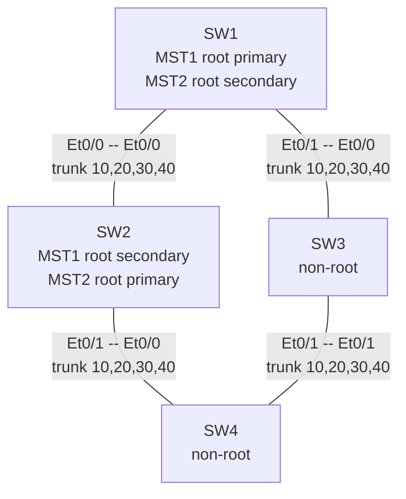
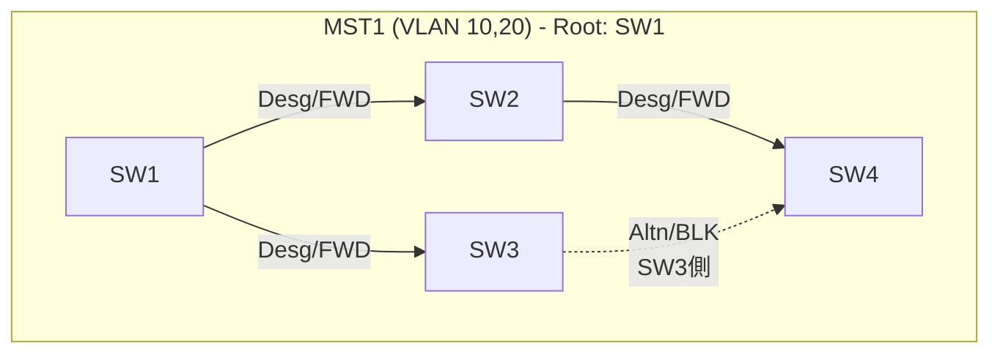
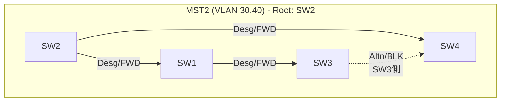

# トポロジ詳細

## 物理構成

インターフェース番号はすべてCML API (`GET /api/v0/labs/{lab}/nodes/{node}/interfaces?data=true`) で実際に払い出された値であり、推測していない。`topology.yaml`に機械可読な形式で記録。

## ベースラインのMST1/MST2フォワーディングツリー(実測値、`outputs/baseline/`のshow出力に基づく)

MST1ではSW3–SW4リンクがSW4側でブロックされ、MST2では同じリンクがSW3側でブロックされる。ブロック位置が異なるため、MST1とMST2で実際の転送パスが分かれ、負荷分散が成立している(試験2で実測確認)。

## ノード・インターフェース対応表

| ノード | Et0/0 | Et0/1 | Et0/2 | Et0/3 |
|---|---|---|---|---|
| SW1 | trunk → SW2 Et0/0 | trunk → SW3 Et0/0 | shutdown(未使用) | shutdown(未使用) |
| SW2 | trunk → SW1 Et0/0 | trunk → SW4 Et0/0 | shutdown(未使用) | shutdown(未使用) |
| SW3 | trunk → SW1 Et0/1 | trunk → SW4 Et0/1 | shutdown(未使用) | shutdown(未使用) |
| SW4 | trunk → SW2 Et0/1 | trunk → SW3 Et0/1 | shutdown(未使用) | shutdown(未使用) |
